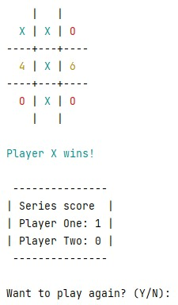

# TicTacToe

My first Java program written from scratch without referring to other implementations or research first.  I was still only on week 3 of the 14 week Tech Elevator bootcamp and only had the command line interface to use as my front end, but I tried to make it as visually pleasing as I could given the limitations.

## Planning
In the planning stages, the biggest decision was what data structure to use to keep track of the board.  I knew a 2D array was the easy answer, but I went with a HashMap thinking that it would be easier to access values. 

## Implementation
To add to usability (and more of a challenge), there was a system implemented to keep track of a series of games and keep a running tally between players.  To speed up playtesting, there is also an option to have 0, 1, or 2 players.  Choosing 0 players will have the computer play itself and I could quickly run tests and see what happens.  Later in the bootcamp, we learn about unit testing, but this worked well at the time.  

Currently, the CPU player uses a random number to choose an available space, this is definitely an area where improvment is needed.  At minimum, the algorithm could check to see if any next move would result in a win to guide the next choice.

## UI/UX
To help with the visual interest, a classmate suggested to use color.  This helps the availabe spaces stand out more and where each player has taken a space easier to read. The minumum error checking was implemented to make sure only allowed characters are entered by the user and bad input won't cause a crash.

